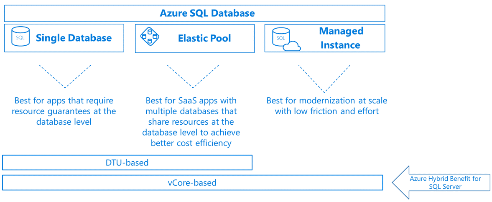

# 02. Azure SQL Database

Tags: azure, cloud, database

Azure SQL Database is a fully managed relational database service in the cloud. It eliminates the need to manage database servers, operating systems, and underlying infrastructure, allowing developers to focus on application development.


*Figure: SQL Database components and high availability setup*

## Table of Contents

- [What is Azure SQL Database](#what-is-azure-sql-database)
- [Key features](#key-features)
- [Deployment models](#deployment-models)
- [Authentication](#authentication)
- [Security and encryption](#security-and-encryption)
- [Backup and recovery](#backup-and-recovery)
- [High availability](#high-availability)
- [Monitoring and alerts](#monitoring-and-alerts)
- [Real-world examples](#real-world-examples)

## What is Azure SQL Database

**Definition**: A fully managed, cloud-based relational database service based on SQL Server.

**Key Points**:
- No server management required
- Automatic backups and updates
- Built-in security and compliance
- Highly scalable
- Pay-as-you-go pricing

### Azure SQL Database vs. On-Premises SQL Server

```
On-Premises SQL Server:
├─ You manage: Hardware, OS, SQL Server, backups, patching
├─ High operational overhead
├─ Requires IT staff
└─ Capital investment required

Azure SQL Database:
├─ Microsoft manages: Hardware, OS, SQL Server, backups, patching
├─ Low operational overhead
├─ Minimal IT staff needed
└─ Pay-as-you-go pricing
```

## Key Features

### Fully Managed Service

```
What Azure manages:
├─ Hardware provisioning
├─ Operating system updates
├─ SQL Server patches
├─ Automated backups
├─ High availability setup
├─ Failover management
└─ Security patches

What you manage:
├─ Database schema
├─ Queries and optimization
├─ User access
├─ Application logic
└─ Data
```

### Automatic Backups

```
Azure performs:
├─ Full backup: Weekly
├─ Differential backup: Daily
├─ Transaction log backup: Every 5-10 minutes
└─ Retention: 7-35 days (configurable)

Benefits:
├─ Point-in-time restore (PITR)
├─ Geo-restore capability
└─ No manual backup management
```

### High Availability

```
Built-in redundancy:
├─ Primary replica (read/write)
├─ Secondary replicas (read-only)
└─ Automatic failover on failure

Result: 99.99% uptime SLA
```

### Built-in Security

```
Security layers:
├─ Network security (firewall, VNet integration)
├─ Data encryption (TDE - Transparent Data Encryption)
├─ Authentication (SQL auth, Azure AD auth)
├─ Audit logging
└─ Threat detection
```

## Deployment Models

### Single Database

```
Use Case: Single application, dedicated resources
Architecture:
└─ One database server (logical)
   └─ Your database
   
Advantages:
├─ Full control
├─ Dedicated resources
├─ Custom pricing tier
└─ High performance

Pricing: Pay-per-database
```

### Elastic Pool

```
Use Case: Multiple databases with varying resource needs
Architecture:
└─ Elastic Pool (shared resources)
   ├─ Database 1 (using 2 DTUs)
   ├─ Database 2 (using 1 DTU)
   ├─ Database 3 (using 3 DTUs)
   └─ Database 4 (using 2 DTUs)
   
Advantages:
├─ Cost savings (shared resources)
├─ Flexible scaling
├─ Easy database provisioning
└─ Ideal for SaaS applications

Pricing: Pay-per-pool
```

## Pricing Tiers

### DTU-Based Model
**DTU**: Database Transaction Unit (bundled compute, storage, IO)

| Tier | DTU Range | Best For |
|------|-----------|----------|
| Basic | 5-100 DTU | Development, testing, small apps |
| Standard | 100-3000 DTU | Small to medium production apps |
| Premium | 3000+ DTU | High-performance, mission-critical apps |

### vCore-Based Model
**vCore**: Virtual core (CPU), with separate storage allocation

```
Example: 4 vCore, 32 GB RAM, 128 GB storage
├─ Compute: 4 virtual cores
├─ Memory: Determined by vCore count
└─ Storage: Separately configured
```

## Authentication

### SQL Authentication

```csharp
// Username and password
var connectionString = 
    "Server=myserver.database.windows.net;" +
    "Database=mydb;" +
    "User Id=sqladmin;" +
    "Password=MyPassword123!";

var connection = new SqlConnection(connectionString);
```

**Advantages**: Familiar, works everywhere
**Disadvantages**: Password management, less secure

### Azure AD Authentication

```csharp
// Using Azure AD managed identity
using Azure.Identity;

var credential = new DefaultAzureCredential();
var connectionString = 
    "Server=myserver.database.windows.net;" +
    "Database=mydb;" +
    "Authentication=Active Directory Default";

var connection = new SqlConnection(connectionString);
```

**Advantages**: No password storage, centralized identity management, MFA support
**Disadvantages**: Requires Azure AD setup

**Best Practice**: Use Azure AD authentication whenever possible.

## Security and Encryption

### Transparent Data Encryption (TDE)

```
Unencrypted data on disk
↓
TDE automatically encrypts
↓
Encrypted data in database files
↓
TDE automatically decrypts on access
↓
Application sees unencrypted data

Benefit: No application code changes needed
```

### Always Encrypted

```csharp
// Column-level encryption
// Client-side encryption before data leaves application

var encryptedSSN = EncryptSSN("123-45-6789");
db.Customers.Add(new Customer { SSN = encryptedSSN });

// Only authorized applications can decrypt
```

### Firewall Rules

```
Azure SQL Firewall:
├─ Block all traffic by default
├─ Allow specific IP ranges
├─ Allow Azure services (internal traffic)
└─ Allow VNet rules

Example rule:
├─ Allow IP: 203.0.113.0/24 (office network)
├─ Allow IP: 198.51.100.5 (VPN)
└─ Allow Azure Services (Azure VMs, App Service)
```

## Backup and Recovery

### Automatic Backups

```
Timeline:
├─ Full backup: Every week
├─ Differential backup: Daily
├─ Transaction log backup: Every 5-10 minutes
└─ Retention: 7-35 days

Recovery Options:
├─ Point-in-time restore (PITR)
├─ Geo-restore (restore to different region)
└─ Long-term retention (years)
```

### Point-in-Time Restore (PITR)

```csharp
// Restore database to specific point in time
// Example: Accidental data deletion at 2:30 PM

// Restore to 2:25 PM (before deletion)
var newDatabase = new Database
{
    Name = "mydb_restored",
    RestorePointInTime = DateTime.Parse("2024-01-15 14:25:00")
};

// Result: Database restored to 2:25 PM state
// Deleted data recovered
```

### Geo-Restore

```
Primary Region (East US)
└─ Database backup
   └─ Replicated to
   └─ Secondary Region (West US)

If primary region fails:
├─ Restore database from secondary region backup
├─ No manual intervention needed
└─ Automatic failover possible
```

## High Availability

### Automatic Failover Groups

```
Primary Database (East US)
├─ Accepts read/write traffic
└─ Data replicated to

Secondary Database (West US)
├─ Standby (read-only)
└─ Automatic failover on primary failure

If primary fails:
├─ Secondary becomes primary
├─ Application connection string updated automatically
└─ No manual intervention needed
```

### Read Replicas

```
Primary Database (East US)
├─ Read/Write operations

Read Replicas:
├─ Replica 1 (West US) - Read-only
├─ Replica 2 (Europe) - Read-only
└─ Replica 3 (Asia) - Read-only

Benefits:
├─ Low-latency reads globally
├─ Distribute read load
└─ Increased availability
```

## Monitoring and Alerts

### Azure Monitor Integration

```
Metrics:
├─ CPU percentage
├─ Data I/O percentage
├─ Log I/O percentage
├─ Storage used
├─ Connection count
└─ Failed connections

Alerts:
├─ CPU > 90%
├─ Storage > 95%
├─ Failed connections > threshold
└─ Connection timeout
```

### Query Performance Insights

```
Analyze slow queries:
├─ Identify resource-intensive queries
├─ View execution plans
├─ Get optimization recommendations
└─ Monitor over time
```

## Real-World Examples

### Example 1: SaaS Application

```
Customer 1: Small business
├─ Database size: 1 GB
└─ Load: Predictable

Customer 2: Large enterprise
├─ Database size: 50 GB
└─ Load: Variable

Solution: Elastic Pool
├─ Shared resources (cost-effective)
├─ Each customer's data isolated
├─ Separate databases per tenant
└─ Automatic resource allocation
```

### Example 2: E-Commerce Platform

```
Production Database (Premium tier):
├─ Orders table (indexed)
├─ Products table (read-heavy)
├─ Users table (authenticated)
└─ Read replicas for reporting

Features:
├─ Automatic backup (hourly)
├─ Geo-redundancy (2 regions)
├─ High availability (99.99% uptime)
└─ Transparent encryption
```

### Example 3: Application Connection

```csharp
// Connect to Azure SQL Database
using System.Data.SqlClient;

var connectionString = 
    "Server=tcp:myserver.database.windows.net,1433;" +
    "Initial Catalog=mydb;" +
    "Persist Security Info=False;" +
    "User ID=sqladmin;" +
    "Password=MyPassword123!;" +
    "MultipleActiveResultSets=False;" +
    "Encrypt=True;" +
    "TrustServerCertificate=False;" +
    "Connection Timeout=30;";

using (SqlConnection connection = new SqlConnection(connectionString))
{
    connection.Open();
    SqlCommand command = new SqlCommand("SELECT * FROM Products", connection);
    SqlDataReader reader = command.ExecuteReader();
    // Process results
}
```

## Best Practices

- Use Azure AD authentication instead of SQL auth
- Enable Transparent Data Encryption (TDE)
- Configure firewall rules restrictively
- Enable automatic backups and monitor retention
- Use connection pooling in applications
- Monitor query performance regularly
- Use read replicas for read-heavy workloads
- Implement geo-redundancy for critical databases
- Use Azure SQL Managed Instance for legacy SQL Server features

## Summary

Azure SQL Database abstracts away infrastructure management while providing enterprise-grade reliability, security, and performance. It's ideal for cloud-native applications and organizations wanting to reduce operational overhead. The automatic backup, high availability, and security features make it a compelling choice for production workloads.
