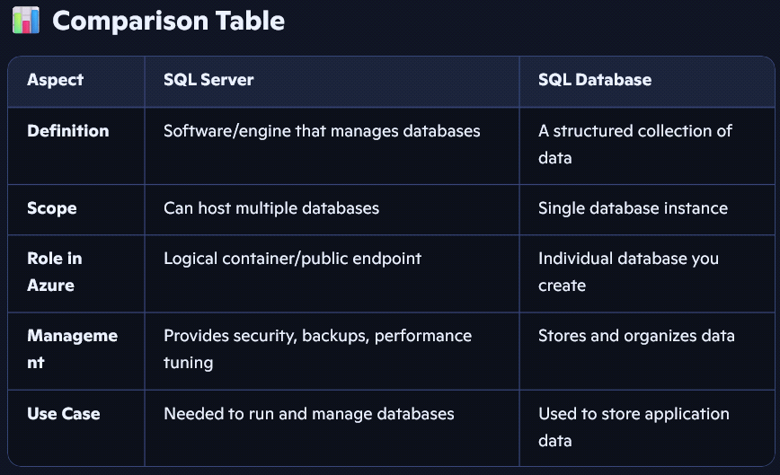

# 03. Azure SQL Elastic Pools

Tags: azure, cloud, database

Azure SQL Elastic Pools allow multiple databases to share resources (compute, storage, memory) dynamically. This is ideal for SaaS applications, multi-tenant systems, and scenarios where databases have varying resource demands.


*Figure: Multiple databases sharing resources in an elastic pool*

## Table of Contents

- [What is an Elastic Pool](#what-is-an-elastic-pool)
- [How elastic pools work](#how-elastic-pools-work)
- [Use cases](#use-cases)
- [Creating an Elastic Pool](#creating-an-elastic-pool)
- [Managing databases in pools](#managing-databases-in-pools)
- [Monitoring performance](#monitoring-performance)
- [Scaling elastic pools](#scaling-elastic-pools)
- [Cost considerations](#cost-considerations)
- [Real-world examples](#real-world-examples)

## What is an Elastic Pool

**Definition**: A shared pool of compute and storage resources allocated to multiple databases.

**Key Concept**: Databases within a pool share resources dynamically based on demand.

### Problem it Solves

```
Scenario: 10 SaaS customers, each with their own database

Without Elastic Pool:
└─ 10 separate single databases
   ├─ Customer 1 DB: High usage (uses 80% of resources)
   ├─ Customer 2 DB: Low usage (uses 5% of resources)
   ├─ Customer 3 DB: Low usage (uses 5% of resources)
   ├─ ... (7 more low-usage databases)
   └─ Cost: High (each database provisioned for peak)
      Total: 10 databases × cost = $High

With Elastic Pool:
└─ Elastic Pool (shared resources)
   ├─ Customer 1 DB: Uses 80% (when needed)
   ├─ Customer 2 DB: Uses 5%
   ├─ Customer 3 DB: Uses 5%
   ├─ Customer 4 DB: Uses 2%
   └─ Total: 100% resource utilization
      Cost: 30-50% savings compared to individual databases
```

## How Elastic Pools Work

### Resource Sharing

```
Elastic Pool (20 eDTUs or 4 vCores)
│
├─ Database 1
│  └─ Using 2 eDTUs (when processing orders)
├─ Database 2
│  └─ Using 3 eDTUs (when generating reports)
├─ Database 3
│  └─ Using 1 eDTU (idle)
├─ Database 4
│  └─ Using 5 eDTUs (peak traffic)
└─ Database 5
   └─ Using 9 eDTUs (active queries)

Total usage: 2+3+1+5+9 = 20 eDTUs (at capacity)
```

### Burst Capability

```
Scenario: Temporary traffic spike in Database 2

Before spike:
├─ Database 1: 2 eDTUs
├─ Database 2: 2 eDTUs
├─ Database 3: 1 eDTU
└─ Total: 5 eDTUs (room for burst)

During spike:
├─ Database 1: 2 eDTUs
├─ Database 2: 12 eDTUs (burst to handle spike)
├─ Database 3: 1 eDTU
└─ Total: 15 eDTUs (still under pool limit)

Result: Database 2 handles spike without degrading other databases
```

### Per-Database Limits

```
Elastic Pool Configuration:
├─ Pool Min eDTU: 5 (minimum per pool)
├─ Pool Max eDTU: 100 (maximum per pool)
├─ Database Min eDTU: 0 (can be idle)
└─ Database Max eDTU: 50 (database cap)

Example usage:
├─ Database 1: Min 2, Max 10 (stable app)
├─ Database 2: Min 0, Max 50 (variable workload)
└─ Database 3: Min 5, Max 20 (critical app)
```

## Use Cases

### SaaS Applications

```
Multi-tenant SaaS platform:
├─ Enterprise customer: Heavy usage (premium tier)
├─ SMB customer: Medium usage (standard tier)
└─ Startup customer: Light usage (starter tier)

All databases in one Elastic Pool:
├─ Enterprise customer's DB: High resource allocation
├─ SMB customer's DB: Medium resource allocation
└─ Startup customer's DB: Low resource allocation
└─ Total cost: Predictable, scalable
```

### Multi-tenant Applications

```
Banking app with multiple banks:
├─ Bank 1 (100M customers): Heavy analytics queries
├─ Bank 2 (10M customers): Standard transaction processing
├─ Bank 3 (1M customers): Light usage

Elastic Pool benefits:
├─ No over-provisioning for small banks
├─ Large banks don't interfere with small banks
└─ Automatic resource rebalancing
```

### Microservices Architecture

```
System with 20+ microservices:
├─ User Service DB: Moderate usage
├─ Order Service DB: High usage (multi-tenant data)
├─ Product Service DB: Read-heavy
├─ Payment Service DB: Critical (guaranteed resources)
├─ Notification Service DB: Low usage
└─ Analytics Service DB: Batch processing

All in one Elastic Pool:
├─ Shared resources
├─ Independent scaling per database
└─ 30-40% cost savings vs individual databases
```

## Creating an Elastic Pool

### Azure Portal

1. Go to Azure Portal → SQL Databases
2. Click "Create" → "Elastic Pool"
3. Fill configuration:
   - Pool name: `myElasticPool`
   - Server: Select or create
   - Compute + storage tier
   - Min/Max eDTU or vCores
4. Add existing or new databases
5. Review and create

### Azure CLI

```bash
# Create elastic pool
az sql elastic-pool create \
  --resource-group myResourceGroup \
  --server myserver \
  --name mypool \
  --dtu 100 \
  --db-dtu-min 5 \
  --db-dtu-max 50

# Add database to pool
az sql db create \
  --resource-group myResourceGroup \
  --server myserver \
  --name mydb \
  --elastic-pool-name mypool
```

## Managing Databases in Pools

### Add Database to Pool

```
Steps:
1. Go to Elastic Pool
2. Click "Configure pool"
3. Click "Add database"
4. Select database
5. Confirm

Result: Database joins pool, resources automatically allocated
```

### Remove Database from Pool

```
Steps:
1. Go to Elastic Pool
2. Click "Configure pool"
3. Select database to remove
4. Click "Remove"
5. Choose standalone tier

Result: Database becomes independent single database
```

### Set Per-Database Limits

```
Database configuration:
├─ Min DTU: Guaranteed minimum allocation
├─ Max DTU: Maximum it can use

Example:
Critical Application DB:
├─ Min eDTU: 10 (always has 10 eDTUs)
└─ Max eDTU: 50 (can scale up to 50 eDTUs)

Low-priority DB:
├─ Min eDTU: 0 (can be idle)
└─ Max eDTU: 5 (limited resource access)
```

## Monitoring Performance

### Pool Metrics

```
Monitor in Azure Portal:
├─ CPU percentage
├─ Data I/O percentage
├─ Log I/O percentage
├─ Storage used vs limit
├─ eDTU consumed
└─ Active connections
```

### Database-Level Monitoring

```
Identify:
├─ Which database is consuming most resources
├─ Query performance per database
├─ Resource contention between databases
└─ Need for scaling
```

### Alerts Configuration

```
Example alert:
├─ Trigger: Pool CPU > 90%
├─ Duration: 5 minutes
├─ Action: Email notification
├─ Follow-up: Scale pool up
```

## Scaling Elastic Pools

### Scale Up (Increase Resources)

```
Current: 100 eDTU pool
↓
Need more capacity (databases growing)
↓
Scale to: 200 eDTU pool
↓
No downtime, automatic scaling
```

### Add Databases

```
Current: 10 databases in pool
↓
Add new tenant (new customer)
↓
Create new database in pool
↓
Automatic resource allocation
```

### Resize Database Limits

```
Database 1 (originally 0-10 eDTU):
├─ Observing high usage
└─ Increase max to 20 eDTU

Database 3 (originally 0-50 eDTU):
├─ Consistently idle
└─ Decrease max to 10 eDTU
```

## Cost Considerations

### Pricing Model

```
Elastic Pool Cost:
└─ Pool tier pricing (fixed)
   ├─ Example: 200 eDTU Standard pool = $X/month
   └─ Regardless of actual usage

No per-database charges (included in pool cost)

vs. Individual Databases:
└─ Each database: $X/month
   └─ 10 databases = 10 × $X = expensive
```

### Cost Savings Example

```
Scenario: 10 databases

Option 1: Individual Databases
├─ Each: Standard (100 eDTU) = $1000/month
└─ Total: 10 × $1000 = $10,000/month

Option 2: Elastic Pool
├─ Pool (200 eDTU): $3,500/month
├─ Supports 10 databases
└─ Total: $3,500/month

Savings: 65% ($6,500/month saved)
```

## Real-World Examples

### Example 1: SaaS Booking Platform

```
Customers:
├─ Hotel chain (1000 properties): Heavy usage
├─ 50 small hotels: Light-medium usage
└─ 200 property managers: Very light usage

Architecture:
└─ Elastic Pool (300 eDTU Standard)
   ├─ Hotel chain DB: Min 50, Max 100 eDTU
   ├─ Small hotels (50 DBs): Min 1, Max 5 eDTU each
   └─ Property managers (200 DBs): Min 0, Max 2 eDTU each

Benefits:
├─ Hotel chain never starved for resources
├─ Small customers share unused capacity
├─ Total cost: $5,000/month
└─ If individual DBs: $40,000/month
```

### Example 2: Analytics Dashboard Platform

```
Businesses using platform:
├─ Large retailer: Analytics, reports (heavy)
├─ Medium business: Dashboard, basic reporting (medium)
├─ 100 small businesses: Simple dashboards (light)

Architecture:
└─ Elastic Pool (500 eDTU Premium)
   ├─ Large retailer: Min 100, Max 200
   ├─ Medium business: Min 10, Max 50
   └─ Small businesses: Min 0, Max 5 each

Peak scenario:
├─ Large retailer: 150 eDTU
├─ Medium business: 40 eDTU
└─ Small businesses: 200 eDTU
└─ Total: 390 eDTU (still under 500 limit)

Result: Everyone gets resources they need
```

## Best Practices

- Right-size the pool based on historical usage patterns
- Use database min/max DTU to protect critical applications
- Monitor pool and database metrics regularly
- Set up alerts for resource constraints
- Use Azure Advisor recommendations for scaling
- Consider business growth when sizing pools
- Test application behavior under pool constraints
- Use Elastic Jobs for maintenance across pool databases

## Summary

Azure SQL Elastic Pools provide a cost-effective way to manage multiple databases with varying resource needs. They're essential for SaaS applications and multi-tenant systems where resource efficiency directly impacts profitability. Understanding how to configure, monitor, and scale elastic pools is critical for managing large database environments economically.
