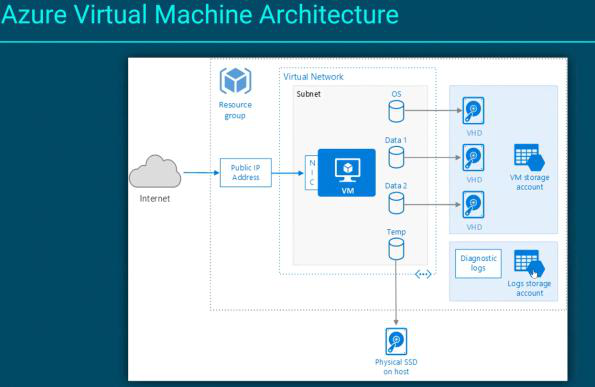

# 03. Azure Compute Services

Tags: azure, cloud

Azure provides multiple compute options for different application patterns. Choosing the right service depends on your need for control, scalability, cost, and management overhead.


*Figure: IaaS vs PaaS compute options and use cases*

## Table of Contents

- [IaaS vs. PaaS overview](#iaas-vs-paas-overview)
- [Virtual Machines](#virtual-machines)
- [VM Scale Sets](#vm-scale-sets)
- [App Service](#app-service)
- [Azure Functions](#azure-functions)
- [Containers: ACI and AKS](#containers-aci-and-aks)
- [Service comparison and decision tree](#service-comparison-and-decision-tree)

## IaaS vs. PaaS Overview

### Infrastructure as a Service (IaaS)
You manage: Application, Data, Runtime, Middleware, OS
Azure manages: Virtualization, Servers, Storage, Networking

### Platform as a Service (PaaS)
You manage: Application, Data
Azure manages: Runtime, Middleware, OS, Virtualization, Servers, Storage, Networking

## Virtual Machines

**Definition**: Full emulation of physical hardware and operating system.

**Service Model**: IaaS

**Best For**:
- Lift-and-shift of legacy applications
- Custom software requiring specific OS configurations
- Full OS control needed (custom drivers, specific OS versions)
- Jumpboxes and gateways

### Advantages
- Complete OS control
- Can install any software
- Can use custom images
- Familiar to on-premises administrators

### Disadvantages
- High management overhead
- You manage OS patches, security updates
- Higher operational cost
- Longer startup time (minutes)

### Real-World Example

```
Legacy Windows Server 2008 Application
↓
Cannot run on PaaS (requires old OS)
↓
Deploy to Azure Virtual Machine
↓
Lift-and-shift migration complete
```

## VM Scale Sets

**Definition**: A group of identical VMs with built-in auto-scaling and load balancing.

**Service Model**: IaaS

**Best For**:
- High-availability workloads
- Auto-scaled web services
- Batch processing
- Consistent VM-level configuration needed

### How It Works

```
Define VM Image (OS + Software)
↓
Create VMSS with min=2, max=10 instances
↓
Set autoscale rules:
├─ Scale out: CPU > 70% → Add 2 VMs
└─ Scale in: CPU < 30% → Remove 1 VM
↓
VMSS automatically manages the lifecycle
```

### Real-World Example

```
Black Friday Traffic Spike
├─ Baseline: 2 VMs
├─ 2 PM: Traffic spikes, CPU > 70%
├─ Auto-scaler triggers → Adds 5 more VMs
├─ 8 VMs total handling traffic
├─ 6 AM Next Day: Traffic drops, CPU < 30%
└─ Auto-scaler reduces → Back to 2 VMs
```

## App Service

**Definition**: An enterprise-grade, fully-managed platform for hosting web applications.

**Service Model**: PaaS

**Supports**: Code-based and containerized deployments

**Best For**:
- Web applications (ASP.NET, Node.js, Python, Java)
- Mobile backends
- RESTful APIs
- Focus on development, not infrastructure

### Advantages
- Fully managed platform
- Built-in CI/CD (GitHub, Azure Repos)
- Automatic scaling
- Security features included
- Lower management overhead

### Disadvantages
- Limited OS/runtime control
- Cannot install arbitrary software
- Scaling is at the app level, not VM level

### Real-World Example

```csharp
// Deploy an ASP.NET application to App Service
[ApiController]
[Route("api/[controller]")]
public class ProductsController : ControllerBase
{
    [HttpGet("{id}")]
    public async Task<Product> Get(int id)
    {
        // Azure handles:
        // - OS updates
        // - Runtime updates
        // - Scaling
        // - Load balancing
        return await _productService.GetAsync(id);
    }
}
```

## Azure Functions

**Definition**: Event-driven serverless compute that executes code in response to a trigger.

**Service Model**: PaaS (Serverless/FaaS)

**Best For**:
- Micro/nano-services
- Event-driven workloads (timers, queues, HTTP triggers)
- Rapid deployment
- Sporadic, unpredictable workloads
- Cost-sensitive scenarios

### Pricing Models

**Consumption Plan (True Serverless)**:
- Pay per execution and memory consumption
- Can scale to zero instances
- Cold start delay possible
- Best for: Variable traffic, cost optimization

**Dedicated (App Service) Plan**:
- Pay for dedicated always-on VMs
- No cold start
- Better for: Consistent workloads, latency-sensitive

### Real-World Example

```
Daily Cleanup Task (runs once at 2 AM)
↓
Azure Function on Consumption Plan
↓
Executes for 30 seconds
↓
Cost: Fraction of a cent per day
↓
Compare: Dedicated VM costs $20/month even when idle
```

## Containers: ACI and AKS

### Difference from VMs

| Aspect | VMs | Containers |
|--------|-----|-----------|
| Virtualization | Hardware (Hypervisor) | OS (Container Engine) |
| Isolation | High (own OS) | Moderate (shared kernel) |
| Size | Large (GB) | Lightweight (MB) |
| Startup | Minutes | Seconds |
| OS | Different from host | Same as host |

### Azure Container Instances (ACI)

**Service Model**: PaaS (Serverless)

**Best For**:
- Small, simple applications
- Background jobs
- Scheduled scripts
- Development/testing
- Simplicity over scale

**Advantages**:
- Simplest way to run containers
- No orchestration needed
- Fast startup
- Serverless pricing

**Disadvantages**:
- Limited to smaller deployments
- No built-in load balancing
- No service discovery

### Azure Kubernetes Service (AKS)

**Service Model**: PaaS

**Best For**:
- Complex microservices
- High-scale production systems
- Need for orchestration, auto-scaling, rolling updates
- Production-grade requirements

**Advantages**:
- Enterprise-grade orchestration
- Automatic scaling and self-healing
- Zero-downtime deployments
- Rich ecosystem

**Disadvantages**:
- Complex to manage
- Steep learning curve
- More expensive than simpler options
- Overkill for simple applications

### Real-World Example

```
Simple Cron Job
↓
Use: Azure Container Instances
↓
"No need for Kubernetes complexity"

Microservices Architecture (50+ services)
├─ Payment service
├─ Inventory service
├─ Order service
├─ Notification service
└─ Analytics service
↓
Use: Azure Kubernetes Service
↓
"Need auto-scaling, self-healing, rolling updates"
```

## Service Comparison and Decision Tree

### Decision Tree

```
Question 1: Need full OS control?
├─ YES → Azure Virtual Machines (IaaS)
└─ NO → Move to Question 2

Question 2: Running traditional web app or API?
├─ YES → Azure App Service (PaaS)
└─ NO → Move to Question 3

Question 3: Event-driven or scheduled task?
├─ YES → Azure Functions (Serverless)
└─ NO → Move to Question 4

Question 4: Container-based architecture?
├─ YES → Simple containers? → Azure Container Instances
├─ YES → Complex orchestration? → Azure Kubernetes Service (AKS)
└─ NO → Consider App Service
```

### Comparison Table

| Service | IaaS/PaaS | Control Level | Scaling | Cost | Management |
|---------|-----------|---------------|---------|------|------------|
| **Virtual Machines** | IaaS | High | Manual | High | High |
| **VM Scale Sets** | IaaS | High | Auto (VMs) | High | High |
| **App Service** | PaaS | Medium | Auto (app) | Medium | Low |
| **Azure Functions** | Serverless | Low | Auto (scale to zero) | Very Low* | Very Low |
| **ACI** | PaaS | Low | Manual | Low | Very Low |
| **AKS** | PaaS | Medium | Auto (pod level) | Medium | High |

*Cost very low for sporadic workloads; higher for continuous execution.

### Real-World Scenarios

**Scenario 1: Legacy Windows Server Application**
```
Requirement: Run custom software on Windows Server 2012
Solution: Virtual Machines
Reason: Need specific OS, full control
```

**Scenario 2: E-Commerce Web Site**
```
Requirement: ASP.NET website with varying traffic
Solution: App Service with Auto-scale
Reason: PaaS simplicity, built-in scaling, fast deployment
```

**Scenario 3: Data Processing Pipeline**
```
Requirement: Process files dropped in blob storage
Solution: Azure Function triggered by blob storage
Reason: Event-driven, sporadic, cost-effective
```

**Scenario 4: Microservices Platform**
```
Requirement: Deploy 30+ microservices, auto-scaling, rolling updates
Solution: Azure Kubernetes Service (AKS)
Reason: Orchestration capabilities, production requirements
```

## Summary

Azure compute services offer a spectrum from full control (VMs) to maximum simplicity (Functions). Your choice depends on:
- How much control you need
- Application architecture (monolithic vs. microservices)
- Scaling requirements
- Cost sensitivity
- Management overhead tolerance

Start simple with App Service or Functions, and move to Containers/Kubernetes only when complexity justifies it.
