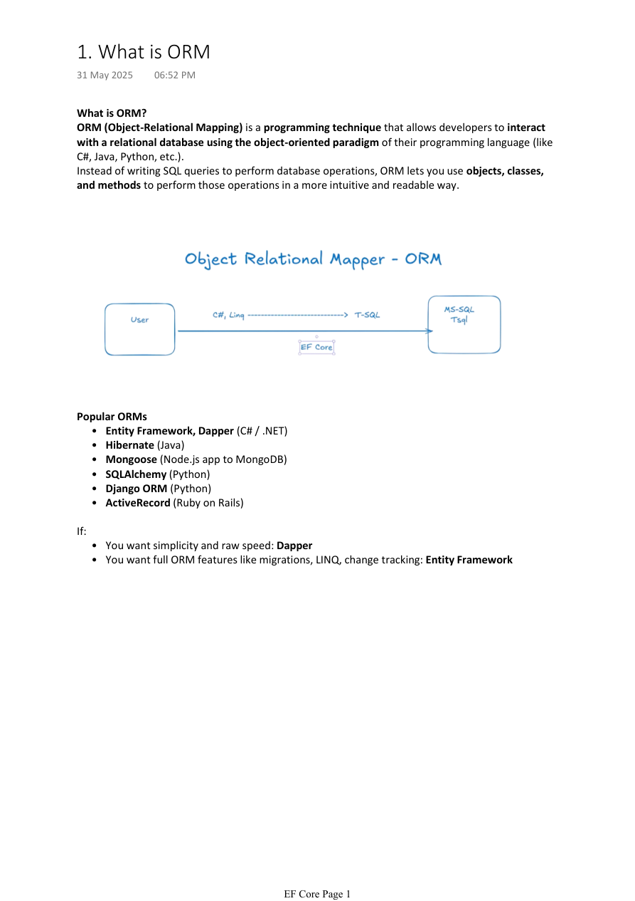

# 01. ORM and Setup

Tags: dotnet, efcore, csharp

ORM stands for Object-Relational Mapping. It lets developers work with database tables as .NET objects instead of writing raw SQL for every operation. In Entity Framework Core, the database is represented through classes and `DbSet<T>` properties, which makes CRUD logic cleaner and easier to maintain.


*Figure: ORM concept and its role in modern application development.*

## Table of Contents

- [What is ORM](#what-is-orm)
- [Why use EF Core](#why-use-ef-core)
- [Install EF Core packages](#install-ef-core-packages)
- [Connection string configuration](#connection-string-configuration)
- [Using Azure Key Vault](#using-azure-key-vault)
- [Docker connection strings](#docker-connection-strings)
- [Real-world example](#real-world-example)

## What is ORM

ORM is a programming technique that maps database tables to classes and objects.

```
Database table: Customers
└─ CustomerId
└─ Name
└─ Email

C# class:
public class Customer
{
    public int CustomerId { get; set; }
    public string Name { get; set; }
    public string Email { get; set; }
}
```

Instead of writing:

```sql
SELECT * FROM Customers WHERE Email = 'john@demo.com';
```

You can write:

```csharp
var customer = context.Customers
    .FirstOrDefault(c => c.Email == "john@demo.com");
```

### Common ORMs

- EF Core for .NET
- Dapper for speed and minimal overhead
- Hibernate for Java
- SQLAlchemy for Python

### When to Choose EF Core

Use EF Core when you want:
- LINQ support
- migrations
- change tracking
- code-first development
- model validation and relationships

Use Dapper when you want:
- faster raw SQL execution
- lower abstraction
- more direct control

## Why use EF Core

EF Core is the recommended ORM for .NET apps because it integrates deeply with ASP.NET Core, SQL Server, and LINQ.

```
Benefits:
├─ Productivity
├─ Strong type safety
├─ Query translation into SQL
├─ Migration support
├─ Easy relationship mapping
├─ Built-in validation and configuration
└─ Good fit for enterprise applications
```

## Install EF Core packages

For SQL Server, use the following:

```bash
dotnet add package Microsoft.EntityFrameworkCore
dotnet add package Microsoft.EntityFrameworkCore.SqlServer
dotnet add package Microsoft.EntityFrameworkCore.Tools
```

In Package Manager Console:

```powershell
Install-Package Microsoft.EntityFrameworkCore.SqlServer
Install-Package Microsoft.EntityFrameworkCore.Tools
```

The tools package enables commands like:
- `add-migration`
- `update-database`
- `dbcontext scaffold`

## Connection string configuration

The connection string is usually stored in `appsettings.json`.

```json
{
  "ConnectionStrings": {
    "DefaultConnection": "Server=localhost;Database=MyDatabase;User Id=myuser;Password=mypassword;"
  }
}
```

Use it in `Program.cs` or `Startup.cs`:

```csharp
var builder = WebApplication.CreateBuilder(args);

builder.Services.AddDbContext<ApplicationDbContext>(options =>
    options.UseSqlServer(builder.Configuration.GetConnectionString("DefaultConnection")));
```

### Minimal `DbContext`

```csharp
public class ApplicationDbContext : DbContext
{
    public ApplicationDbContext(DbContextOptions<ApplicationDbContext> options)
        : base(options)
    {
    }

    public DbSet<Product> Products { get; set; }
}
```

## Using Azure Key Vault

For production environments, it is best practice to store connection strings in Azure Key Vault instead of committing them to source control.

```csharp
var builder = WebApplication.CreateBuilder(args);

builder.Configuration.AddAzureKeyVault(
    new Uri("https://<your-keyvault-name>.vault.azure.net/"),
    new DefaultAzureCredential());

var connectionString = builder.Configuration["ConnectionStrings:DefaultConnection"];

builder.Services.AddDbContext<ApplicationDbContext>(options =>
    options.UseSqlServer(connectionString));
```

### Required packages

```bash
dotnet add package Azure.Extensions.AspNetCore.Configuration.Secrets
dotnet add package Azure.Identity
```

This is especially useful when you are deploying to Azure App Service, Azure Container Apps, or Kubernetes.

## Docker connection strings

When using Docker, you often pass the connection string through environment variables.

```yaml
version: '3.4'
services:
  myapp:
    image: myapp:latest
    environment:
      - ConnectionStrings__DefaultConnection=Server=mydb;Database=MyDatabase;User Id=myuser;Password=mypassword;
```

This allows the app to read environment variables into configuration without hardcoding secrets.

## Real-world example

### Example: E-commerce product catalog

A company stores products in SQL Server and wants to query them using LINQ instead of manual SQL.

```csharp
public class Product
{
    public int Id { get; set; }
    public string Name { get; set; }
    public decimal Price { get; set; }
    public int CategoryId { get; set; }
}

public class ProductDbContext : DbContext
{
    public DbSet<Product> Products { get; set; }

    protected override void OnConfiguring(DbContextOptionsBuilder optionsBuilder)
    {
        optionsBuilder.UseSqlServer("Server=.;Database=ShopDb;Trusted_Connection=True;");
    }
}
```

Query products in a repository:

```csharp
public class ProductRepository
{
    private readonly ProductDbContext _context;

    public ProductRepository(ProductDbContext context)
    {
        _context = context;
    }

    public List<Product> GetProductsByCategory(int categoryId)
    {
        return _context.Products
            .Where(p => p.CategoryId == categoryId)
            .ToList();
    }
}
```

## Best practices

- Store secrets in user secrets or Azure Key Vault, not in source code.
- Keep the connection string in configuration rather than hardcoded literals.
- Use dependency injection for `DbContext` in ASP.NET Core.
- Keep environment-specific configs separate for dev, staging, and prod.

## Summary

EF Core is a powerful ORM for .NET applications because it makes database access easier, safer, and more maintainable. With proper setup, connection-string management, and dependency injection, EF Core helps teams build clean and scalable data access layers.
