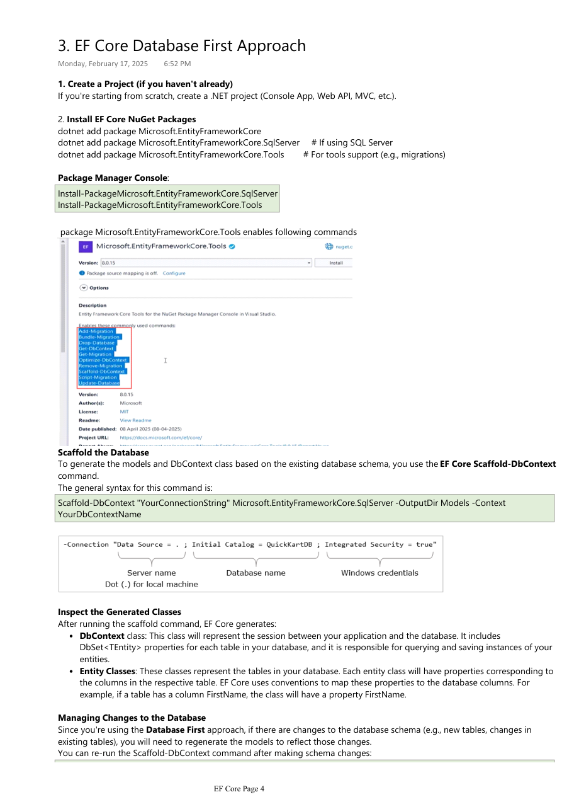

# 02. Database First Approach

Tags: dotnet, efcore, csharp

Database First is a common EF Core workflow when an existing database already exists. Instead of writing models manually, you scaffold the database schema into entity classes and a `DbContext`.


*Figure: Reverse engineering an existing database into EF Core entities.*

## Table of Contents

- [Overview](#overview)
- [Setup requirements](#setup-requirements)
- [Scaffold database](#scaffold-database)
- [Inspect generated classes](#inspect-generated-classes)
- [Repository pattern example](#repository-pattern-example)
- [Convert DB First to Code First](#convert-db-first-to-code-first)
- [Best practices](#best-practices)

## Overview

Database First is best when:
- the schema already exists in SQL Server
- the team is working with a legacy system
- an existing database is the source of truth

In this approach, EF Core reads the database schema and generates:
- entity classes
- navigation properties
- `DbContext`
- relationships and configuration

## Setup requirements

Install the EF Core packages first:

```bash
dotnet add package Microsoft.EntityFrameworkCore
dotnet add package Microsoft.EntityFrameworkCore.SqlServer
dotnet add package Microsoft.EntityFrameworkCore.Tools
```

Then run the scaffold command:

```bash
dotnet ef dbcontext scaffold "YourConnectionString" Microsoft.EntityFrameworkCore.SqlServer --output-dir Models --context YourDbContext --context-dir Data --force
```

### Optional table filter

```bash
dotnet ef dbcontext scaffold "YourConnectionString" Microsoft.EntityFrameworkCore.SqlServer --output-dir Models --context YourDbContext --context-dir Data --force --tables Product
```

This is useful when you only need selected tables instead of the full database.

## Scaffold database

The generated code usually contains:
- `DbContext` with `DbSet<T>` properties
- entity classes for tables
- relationship mappings

### Example generated `DbContext`

```csharp
public class QuickKartDbContext : DbContext
{
    public QuickKartDbContext(DbContextOptions<QuickKartDbContext> options)
        : base(options)
    {
    }

    public DbSet<Product> Products { get; set; }
    public DbSet<Category> Categories { get; set; }
}
```

### Example generated entity

```csharp
public partial class Product
{
    public int Id { get; set; }
    public string Name { get; set; }
    public decimal Price { get; set; }
    public int CategoryId { get; set; }
    public virtual Category Category { get; set; }
}
```

## Inspect generated classes

After scaffolding, inspect the generated classes and verify:
- table names are correct
- foreign keys are mapped properly
- column names and nullability match the database schema

EF Core will generate navigation properties and can map many-to-one relationships automatically.

## Repository pattern example

```csharp
public class QuickKartRepository
{
    private readonly QuickKartDbContext _context;

    public QuickKartRepository(QuickKartDbContext context)
    {
        _context = context;
    }

    public List<Product> GetProductsOnCategoryId(byte categoryId)
    {
        try
        {
            return _context.Products
                .Where(p => p.CategoryId == categoryId)
                .ToList();
        }
        catch (Exception)
        {
            return new List<Product>();
        }
    }

    public bool AddCategory(string categoryName)
    {
        try
        {
            var category = new Category { CategoryName = categoryName };
            _context.Categories.Add(category);
            _context.SaveChanges();
            return true;
        }
        catch (Exception)
        {
            return false;
        }
    }

    public bool DeleteProduct(int productId)
    {
        try
        {
            var product = _context.Products.Find(productId);
            if (product == null)
                return false;

            _context.Products.Remove(product);
            _context.SaveChanges();
            return true;
        }
        catch (Exception)
        {
            return false;
        }
    }
}
```

This is a practical pattern used in many layered applications: repository -> service -> controller.

## Convert DB First to Code First

Sometimes a team starts with an existing database, but later wants to move to Code First for more control.

### Suggested approach

1. Run `add-migration` after creating the model classes.
2. Remove or simplify the generated `Up` and `Down` methods if needed.
3. Run `update-database`.
4. Check migration history and continue managing schema changes with migrations.

### Example

```csharp
protected override void Up(MigrationBuilder migrationBuilder)
{
    // Add table creation logic here
}

protected override void Down(MigrationBuilder migrationBuilder)
{
    // Roll back changes here
}
```

This transition is useful when the team wants stronger versioning and easier schema evolution.

## Best practices

- Use scaffolding only when the database is stable and the schema is the source of truth.
- Re-run scaffolding when the database changes significantly.
- Review generated code before committing it to production.
- Keep repository and data-access logic separate from business logic.
- Use `--force` carefully when regenerating models.

## Real-world example

A legacy system already has a SQL Server database with `Products`, `Categories`, and `Orders`. The team needs to create a .NET API quickly, so they scaffold the database into EF Core models. The resulting entities are then used in repositories and controllers without rewriting the entire database layer.

This is a major advantage of Database First: speed and minimal migration risk.

## Summary

Database First is useful when you have a stable database and want to accelerate application development by generating EF Core models automatically. It is especially effective for brownfield systems, legacy databases, and teams who want to quickly connect their app to a mature schema.
