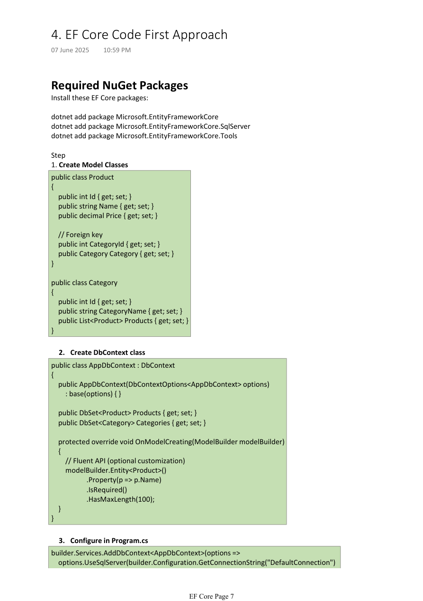

# 03. Code First Approach

Tags: dotnet, efcore, csharp

Code First is the most common modern EF Core workflow. In this model, developers define entity classes and a `DbContext` first, then generate and apply migrations to create the database schema.


*Figure: Model classes and migration flow in the Code First approach.*

## Table of Contents

- [Overview](#overview)
- [Required packages](#required-packages)
- [Create model classes](#create-model-classes)
- [Create DbContext](#create-dbcontext)
- [Register DbContext in ASP.NET Core](#register-dbcontext-in-aspnet-core)
- [Add migration and update database](#add-migration-and-update-database)
- [Rollback migration](#rollback-migration)
- [Real-world example](#real-world-example)

## Overview

In Code First, the model classes become the source of truth.

```
C# Model Classes
   ↓
EF Core Migrations
   ↓
Database Schema
```

This gives developers a clean, controlled way to evolve the database schema as the application evolves.

## Required packages

```bash
dotnet add package Microsoft.EntityFrameworkCore
dotnet add package Microsoft.EntityFrameworkCore.SqlServer
dotnet add package Microsoft.EntityFrameworkCore.Tools
```

## Create model classes

```csharp
public class Product
{
    public int Id { get; set; }
    public string Name { get; set; }
    public decimal Price { get; set; }

    public int CategoryId { get; set; }
    public Category Category { get; set; }
}

public class Category
{
    public int Id { get; set; }
    public string CategoryName { get; set; }
    public List<Product> Products { get; set; }
}
```

The model reflects the business domain rather than the physical database schema directly.

## Create DbContext

```csharp
public class AppDbContext : DbContext
{
    public AppDbContext(DbContextOptions<AppDbContext> options)
        : base(options)
    {
    }

    public DbSet<Product> Products { get; set; }
    public DbSet<Category> Categories { get; set; }

    protected override void OnModelCreating(ModelBuilder modelBuilder)
    {
        modelBuilder.Entity<Product>()
            .Property(p => p.Name)
            .IsRequired()
            .HasMaxLength(100);
    }
}
```

### Fluent API example

```csharp
modelBuilder.Entity<Product>()
    .Property(p => p.Name)
    .HasColumnName("ProductName")
    .HasMaxLength(100)
    .IsRequired();
```

## Register DbContext in ASP.NET Core

```csharp
var builder = WebApplication.CreateBuilder(args);

builder.Services.AddDbContext<AppDbContext>(options =>
    options.UseSqlServer(builder.Configuration.GetConnectionString("DefaultConnection")
        ?? throw new InvalidOperationException("Connection string 'DefaultConnection' not found.")));
```

This lets ASP.NET Core manage `DbContext` lifetime and dependency injection automatically.

## Add migration and update database

### Add migration

```bash
add-migration InitialCreate
```

This creates files under `Migrations` containing schema changes.

### Update database

```bash
update-database
```

### Example migration structure

```csharp
public partial class InitialCreate : Migration
{
    protected override void Up(MigrationBuilder migrationBuilder)
    {
        migrationBuilder.CreateTable(
            name: "Categories",
            columns: table => new
            {
                Id = table.Column<int>(type: "int", nullable: false)
                    .Annotation("SqlServer:Identity", "1, 1"),
                CategoryName = table.Column<string>(type: "nvarchar(max)", nullable: true)
            },
            constraints: table =>
            {
                table.PrimaryKey("PK_Categories", x => x.Id);
            });
    }

    protected override void Down(MigrationBuilder migrationBuilder)
    {
        migrationBuilder.DropTable(
            name: "Categories");
    }
}
```

## Rollback migration

If a migration is wrong or not yet needed in production, you can revert it.

```bash
Get-Migrations
Update-Database <PreviousMigrationName>
Remove-Migration
```

This helps in development and testing environments to undo the most recent schema change cleanly.

## Real-world example

### Example: Online store

A startup wants to build a product catalog with categories and products.

```csharp
public class Product
{
    public int Id { get; set; }
    public string Name { get; set; }
    public decimal Price { get; set; }
    public int CategoryId { get; set; }
    public Category Category { get; set; }
}

public class Category
{
    public int Id { get; set; }
    public string CategoryName { get; set; }
    public List<Product> Products { get; set; }
}
```

After adding the models and `DbContext`, the team runs:

```bash
add-migration AddProductsAndCategories
update-database
```

Now the database schema is created from the C# model layer with full version control in the migration history.

## Best practices

- Keep models clean and domain-driven.
- Use migrations for schema evolution.
- Avoid editing migration files manually unless necessary.
- Use `Data Annotations` or `Fluent API` depending on team preference and project size.
- Always test migrations in a dev environment before applying to production.

## Summary

Code First is the modern and most scalable approach for .NET application teams. It keeps the model and schema together in version-controlled migrations, making it easier to evolve your database safely as the application grows.
