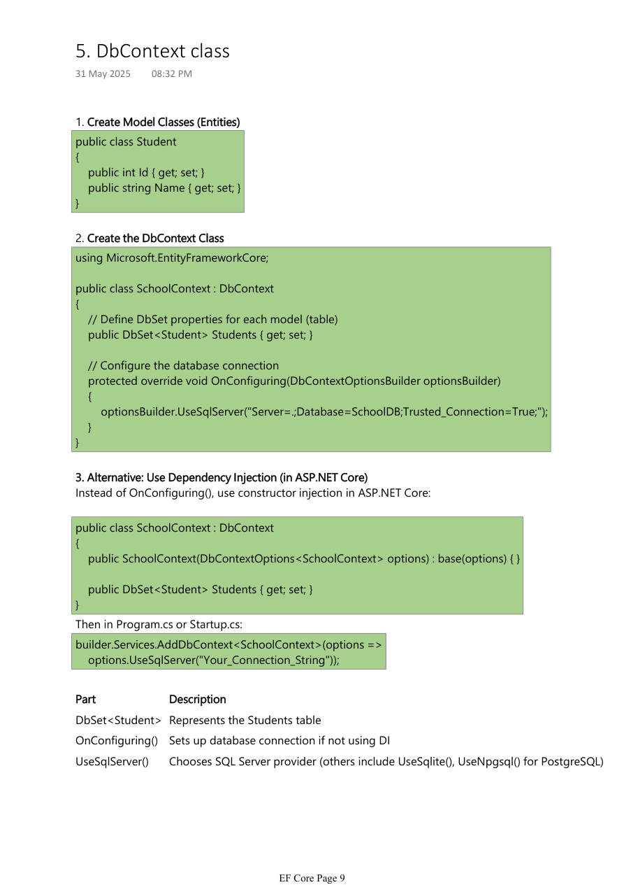

# 04. DbContext Configuration and Relationships

Tags: dotnet, efcore, csharp

`DbContext` is the central object in EF Core. It represents the database session and manages entity tracking, queries, inserts, updates, and deletes. Understanding configuration and relationships is essential for building clean and reliable EF Core models.


*Figure: The DbContext class and its role in connecting the application to SQL Server.*

## Table of Contents

- [What is DbContext](#what-is-dbcontext)
- [OnConfiguring and dependency injection](#onconfiguring-and-dependency-injection)
- [Data annotations](#data-annotations)
- [Fluent API](#fluent-api)
- [Entity relationships](#entity-relationships)
- [Separate configuration classes](#separate-configuration-classes)
- [Real-world example](#real-world-example)

## What is DbContext

`DbContext` is the runtime object used by EF Core to talk to the database.

```csharp
public class SchoolContext : DbContext
{
    public DbSet<Student> Students { get; set; }

    protected override void OnConfiguring(DbContextOptionsBuilder optionsBuilder)
    {
        optionsBuilder.UseSqlServer("Server=.;Database=SchoolDB;Trusted_Connection=True;");
    }
}
```

It does the following:
- tracks entity states
- executes queries
- saves changes to the database
- manages relationships and validation

## OnConfiguring and dependency injection

### Option 1: `OnConfiguring`

```csharp
public class SchoolContext : DbContext
{
    public DbSet<Student> Students { get; set; }

    protected override void OnConfiguring(DbContextOptionsBuilder optionsBuilder)
    {
        optionsBuilder.UseSqlServer("Server=.;Database=SchoolDB;Trusted_Connection=True;");
    }
}
```

### Option 2: Dependency injection in ASP.NET Core

```csharp
public class SchoolContext : DbContext
{
    public SchoolContext(DbContextOptions<SchoolContext> options) : base(options)
    {
    }

    public DbSet<Student> Students { get; set; }
}
```

And in `Program.cs`:

```csharp
builder.Services.AddDbContext<SchoolContext>(options =>
    options.UseSqlServer("Your_Connection_String"));
```

This is the preferred method for ASP.NET Core apps because it is easier to manage lifetimes and testing.

## Data annotations

Data annotations are declarative attributes applied directly to properties and classes.

```csharp
public class Product
{
    [Key]
    public int Id { get; set; }

    [Required]
    [MaxLength(100)]
    public string Name { get; set; }

    [Precision(10, 2)]
    public decimal Price { get; set; }
}
```

### Common attributes

| Attribute | Purpose |
|----------|---------|
| `[Key]` | Primary key |
| `[Required]` | Non-null field |
| `[MaxLength]` | Maximum length |
| `[StringLength]` | Length validation |
| `[ForeignKey]` | Explicit FK mapping |
| `[NotMapped]` | Exclude from database |
| `[Index]` | Create index |
| `[DatabaseGenerated]` | Identity/computed generation |

## Fluent API

Fluent API provides more control and keeps attributes out of entity classes when needed.

```csharp
protected override void OnModelCreating(ModelBuilder modelBuilder)
{
    modelBuilder.Entity<Product>()
        .ToTable("tbl_Products")
        .Property(p => p.Name)
        .IsRequired()
        .HasMaxLength(100);
}
```

### Useful Fluent API methods

```csharp
builder.HasKey(e => e.Id);
builder.Property(p => p.Name).HasColumnName("ProductName");
builder.Property(p => p.Price).HasColumnType("decimal(18,2)");
builder.HasIndex(p => p.Name).IsUnique();
builder.HasOne(p => p.Category).WithMany(c => c.Products).HasForeignKey(p => p.CategoryId);
```

### Separate configuration class

This keeps the `DbContext` clean in large projects.

```csharp
public class ProductConfiguration : IEntityTypeConfiguration<Product>
{
    public void Configure(EntityTypeBuilder<Product> builder)
    {
        builder.ToTable("tbl_Products");
        builder.Property(p => p.Name)
            .IsRequired()
            .HasMaxLength(100);
    }
}
```

Register it in the context:

```csharp
protected override void OnModelCreating(ModelBuilder modelBuilder)
{
    modelBuilder.ApplyConfiguration(new ProductConfiguration());
}
```

Or auto-register all configuration classes in an assembly:

```csharp
modelBuilder.ApplyConfigurationsFromAssembly(typeof(AppDbContext).Assembly);
```

## Entity relationships

EF Core supports the main relationship types.

### 1. One-to-one

```csharp
public class Student
{
    public int StudentId { get; set; }
    public string Name { get; set; }
    public Address Address { get; set; }
}

public class Address
{
    public int StudentId { get; set; }
    public string City { get; set; }
    public Student Student { get; set; }
}
```

Fluent API:

```csharp
modelBuilder.Entity<Student>()
    .HasOne(s => s.Address)
    .WithOne(a => a.Student)
    .HasForeignKey<Address>(a => a.StudentId);
```

### 2. One-to-many

```csharp
public class Department
{
    public int DepartmentId { get; set; }
    public string DeptName { get; set; }
    public ICollection<Employee> Employees { get; set; }
}

public class Employee
{
    public int EmployeeId { get; set; }
    public string EmpName { get; set; }
    public int DepartmentId { get; set; }
    public Department Department { get; set; }
}
```

Fluent API:

```csharp
modelBuilder.Entity<Employee>()
    .HasOne(e => e.Department)
    .WithMany(d => d.Employees)
    .HasForeignKey(e => e.DepartmentId);
```

### 3. Many-to-many

```csharp
public class Course
{
    public int CourseId { get; set; }
    public string Title { get; set; }
    public ICollection<Student> Students { get; set; }
}

public class Student
{
    public int StudentId { get; set; }
    public string Name { get; set; }
    public ICollection<Course> Courses { get; set; }
}
```

Fluent API:

```csharp
modelBuilder.Entity<Course>()
    .HasMany(c => c.Students)
    .WithMany(s => s.Courses)
    .UsingEntity(j => j.ToTable("StudentCourses"));
```

## Real-world example

An enterprise HR system has departments and employees.

- Each department can have many employees.
- Each employee belongs to one department.
- This maps naturally via a one-to-many relationship.

```csharp
public class Department
{
    public int Id { get; set; }
    public string Name { get; set; }
    public ICollection<Employee> Employees { get; set; }
}

public class Employee
{
    public int Id { get; set; }
    public string Name { get; set; }
    public int DepartmentId { get; set; }
    public Department Department { get; set; }
}
```

This relationship is easy to query and maintain using EF Core.

## Best practices

- Prefer Fluent API for complex relationship mappings and large applications.
- Use configuration classes for separation of concerns.
- Use navigation properties and foreign key fields consistently.
- Keep relationship names meaningful and readable.
- Validate indexes and constraints before production deployment.

## Summary

`DbContext` is the heart of EF Core. It provides database access, entity tracking, and query execution. When combined with proper configuration, Data Annotations, and relationship mapping, EF Core enables clean domain modeling and reliable data-layer design.
