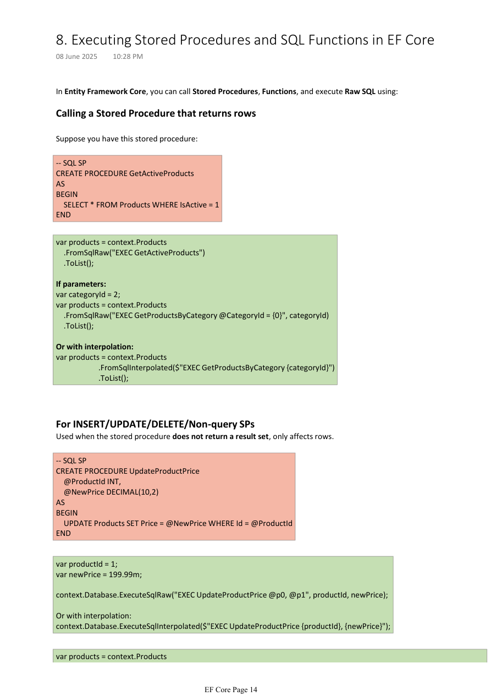

# 05. Raw SQL, Stored Procedures, and Async Errors

Tags: dotnet, efcore, csharp

EF Core is not limited to LINQ only. It can also execute raw SQL, call stored procedures, and interact with database functions. It also has some common runtime issues related to async operations, disposal, and concurrency that are important to understand in real applications.


*Figure: Calling SQL and stored procedures through EF Core.*

## Table of Contents

- [Raw SQL](#raw-sql)
- [Stored procedures](#stored-procedures)
- [Database functions](#database-functions)
- [DbContext concurrency and async errors](#dbcontext-concurrency-and-async-errors)
- [Why async must be awaited](#why-async-must-be-awaited)
- [Real-world example](#real-world-example)

## Raw SQL

EF Core can execute raw SQL when you need custom database logic.

```csharp
var products = context.Products
    .FromSqlRaw("SELECT * FROM Products WHERE Price > {0}", 1000)
    .ToList();
```

### Use cases
- custom filtering not expressible in LINQ
- direct SQL debugging
- using database-specific features

## Stored procedures

### Stored procedure returning rows

```sql
CREATE PROCEDURE GetActiveProducts
AS
BEGIN
    SELECT * FROM Products WHERE IsActive = 1
END
```

EF Core call:

```csharp
var products = context.Products
    .FromSqlRaw("EXEC GetActiveProducts")
    .ToList();
```

### Stored procedure with parameters

```csharp
var categoryId = 2;

var products = context.Products
    .FromSqlRaw("EXEC GetProductsByCategory @CategoryId = {0}", categoryId)
    .ToList();
```

Or interpolation style:

```csharp
var products = context.Products
    .FromSqlInterpolated($"EXEC GetProductsByCategory {categoryId}")
    .ToList();
```

### Non-query stored procedures

```sql
CREATE PROCEDURE UpdateProductPrice
    @ProductId INT,
    @NewPrice DECIMAL(10,2)
AS
BEGIN
    UPDATE Products SET Price = @NewPrice WHERE Id = @ProductId
END
```

```csharp
var productId = 1;
var newPrice = 199.99m;

context.Database.ExecuteSqlRaw("EXEC UpdateProductPrice @p0, @p1", productId, newPrice);
```

Or:

```csharp
context.Database.ExecuteSqlInterpolated($"EXEC UpdateProductPrice {productId}, {newPrice}");
```

## Database functions

Entity Framework Core can map database functions to LINQ through `HasDbFunction`.

```csharp
var products = context.Products
    .Where(p => p.Price > 1000)
    .ToList();
```

This is useful for custom SQL functions or scalar calculations that need to be reused in LINQ queries.

## DbContext concurrency and async errors

A very common EF Core issue is:

`A second operation was started on this context`

### Cause

`DbContext` is not thread-safe. This error usually happens when:
- multiple queries run in parallel on the same `DbContext`
- the same context instance is used across threads
- a context is disposed while async work is still running

### Example exception

```text
System.ObjectDisposedException: Cannot access a disposed context instance.
```

This often happens when:
- `AddAsync()`, `SaveChangesAsync()`, or `CommitAsync()` are called but not awaited
- the HTTP request ends before async DB work completes
- the dependency injection container disposes the context too early

## Why async must be awaited

When async database methods are not awaited, execution may continue while the request lifecycle ends and `DbContext` is disposed.

```csharp
public async Task<IActionResult> CreateOrderAsync()
{
    await _context.Orders.AddAsync(order);
    await _context.SaveChangesAsync();
    return Ok();
}
```

If you skip `await`, the method may return too soon and the request can finish before the database operation is complete.

### Correct pattern

```csharp
public async Task SaveOrderAsync(Order order)
{
    await _context.Orders.AddAsync(order);
    await _context.SaveChangesAsync();
}
```

### Best practices

- Always await async EF Core methods.
- Use scoped lifetime for `DbContext` in ASP.NET Core.
- Do not use the same context instance from multiple threads.
- Keep query and save operations inside the same request scope.

## Real-world example

### Example: Payment processing API

A payment API performs these steps:
1. create order
2. update inventory
3. save payment
4. send email notification

If the developer forgets to await `SaveChangesAsync()`, the request may end before the database transaction is committed.

```csharp
public async Task<IActionResult> ProcessPaymentAsync(Order order)
{
    await _context.Orders.AddAsync(order);
    await _context.SaveChangesAsync();

    return Ok(new { success = true });
}
```

This guarantees the database has finished saving before the response is sent.

## Summary

EF Core can do much more than simple LINQ queries. It supports raw SQL, stored procedures, and database-specific SQL patterns when needed. But with that flexibility comes responsibility: async methods must be awaited properly, and `DbContext` should be managed carefully to avoid concurrency and disposal issues.
